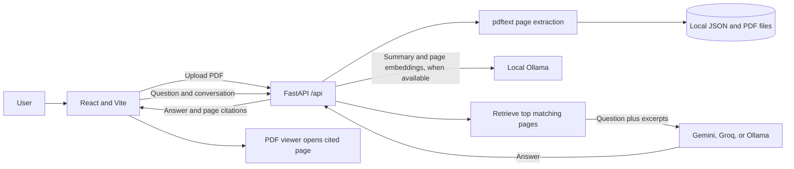

# ASTRA INTEL

**Challenge 01 — AI-Powered Defence Document Intelligence System**

ASTRA INTEL helps users search and understand technical documents. Upload a PDF, get a concise summary, ask questions in natural language, and inspect the source pages cited in each answer.

## Problem

Defence and technology teams work with long reports, research papers, articles, and PDFs. Manually finding a relevant detail takes time. ASTRA extracts page text and retrieves relevant passages so users can ask questions and check answers against the source.

## Features

### Core

- Upload and store multiple text-based PDF documents.
- Extract text page-by-page and display the original PDF.
- Generate a concise summary. Local Ollama is used when available; otherwise ASTRA creates an extractive summary from the document text.
- Ask questions about the selected document.
- Ground answers in retrieved passages and return page and section citations.
- Reply that the document does not contain the answer when no relevant passage is found.
- Show conversation history for the current browser session.
- Handle empty, corrupt, oversized, unsupported, and text-empty PDFs with error messages.

### Additional

- Use Gemini or Groq for chat generation, with provider fallback, or choose local Ollama.
- Use local `bge-m3` embeddings for semantic page search when the Ollama model is available.
- Fall back to keyword-based page retrieval when embeddings are unavailable.
- Include three defence and technology starter PDFs and an additional Birds (Aves) PDF for upload checks.

## Technology stack

| Part | Technology | Role |
|---|---|---|
| Frontend | React 18, Vite, Lucide, CSS | Document library, upload flow, chat, citations, and PDF viewer |
| API | FastAPI, Pydantic | Document endpoints, processing state, chat, and validation |
| PDF extraction | `pdftext` | Extract text while preserving PDF page boundaries |
| Local generation | Ollama, `llama3.1` by default | Summary generation and optional local chat |
| Local embeddings | Ollama, `bge-m3` by default | Page and question vectors for semantic retrieval |
| Hosted chat | Gemini API and Groq API | Generate answers from the retrieved excerpts |
| Storage | Local PDF files and JSON metadata | Persist documents, extracted pages, summaries, and embeddings |

ASTRA does not use ChromaDB or a SQL database in this version. Page vectors are saved in the local JSON document registry.

## Architecture



### Request flow

1. The browser uploads a PDF to `POST /api/documents`.
2. The API validates the file and extracts text for each page. The PDF and extracted page records are saved locally.
3. ASTRA generates a summary and attempts to create page embeddings in a background task. If local Ollama is unavailable, it uses an extractive summary and keyword retrieval instead. Processing can finish without Ollama.
4. When a user asks a question, ASTRA ranks the selected document's pages and chooses up to five relevant excerpts.
5. The selected chat provider receives the question and those excerpts. The whole PDF is not sent for chat.
6. The API returns the answer and citations. The interface displays citations as buttons that move the PDF viewer to the cited page.

## AI pipeline and model choices

### Summary

When available, Ollama runs `llama3.1` over up to the first 12 pages, with an 18,000-character context limit. If Ollama is unavailable or times out, ASTRA builds an extractive summary from the opening pages. This fallback keeps document processing usable but may be less informative than an LLM summary.

### Retrieval

When `bge-m3` is available in Ollama, ASTRA embeds pages in batches and ranks pages by cosine similarity to the question. Embeddings are stored with the document so they do not need to be recreated for each question. If embedding fails or times out, ASTRA records that state and uses keyword overlap instead of repeatedly retrying the failed index.

Retrieval is page-level. It returns up to five pages with matching terms or embedding similarity. Page citations are created by the API from the retrieved pages, rather than asking the model to invent page numbers.

### Chat providers

`ASTRA_CHAT_PROVIDER=auto` tries Gemini first, then Groq, then local Ollama. Set `ASTRA_CHAT_PROVIDER` to `gemini`, `groq`, or `ollama` to use a single provider. Defaults are `gemini-3.8-flash` for Gemini and `openai/gpt-oss-20b` for Groq; set `GEMINI_MODEL` or `GROQ_MODEL` to change them.

The prompt instructs the model to answer only from the retrieved excerpts, ignore instructions found inside document text, and state when the excerpts do not support an answer. This reduces unsupported responses but cannot guarantee that every model answer is correct.

### Privacy

PDFs and document records are stored under the local `data/` directory by default. Local extraction, summaries, and embeddings remain on the machine. If Gemini or Groq is used for chat, ASTRA sends the user's question, recent conversation text, and retrieved page excerpts to that provider. Do not use hosted chat with documents that you are not permitted to send to an external service. Keep API keys in the backend `.env` file; never place them in the frontend or commit them.

## Project layout

```text
text-extract-api/
├── frontend/                  # React/Vite app
├── text_extract_api/
│   ├── astra.py                # ASTRA routes and document Q&A pipeline
│   └── main.py                 # FastAPI application
├── markdowns/
│   ├── sample-documents/       # Three starter PDFs
│   ├── data/pages/             # Page text for the starter corpus
│   ├── data/documents.json     # Starter-document metadata
│   └── Birds ... .pdf          # Additional upload example
├── data/                       # Local uploads and runtime document registry
├── .env.example
└── pyproject.toml
```

Runtime data, API keys, Python environments, frontend dependencies, and generated vector index files are excluded by `.gitignore`. The starter PDFs and page text are project assets and should remain available in the repository.

## Requirements

- Python 3.10 or newer.
- Node.js 18 or newer and npm.
- Ollama is optional. Install it and pull the models below to enable generated summaries and semantic embeddings. ASTRA can still process text PDFs without it.
- A Gemini API key, a Groq API key, or a working local Ollama model is required to generate chat answers. Gemini and Groq keys are optional individually; `auto` uses whichever providers are configured.

For local Ollama summaries and embeddings:

```powershell
ollama pull llama3.1
ollama pull bge-m3
```

## Setup

Run these commands from the repository root, `text-extract-api`.

### 1. Create the Python environment

```powershell
python -m venv .venv
.\.venv\Scripts\Activate.ps1
python -m pip install -e .
```

On macOS or Linux, activate with `source .venv/bin/activate`.

The project dependency file also includes the original OCR utility's dependencies, so installation may take time. ASTRA's PDF upload path uses the already included `pdftext` dependency.

### 2. Configure environment variables

Create `.env` from the template if it does not already exist:

```powershell
Copy-Item .env.example .env
```

For a native local run, set `OLLAMA_HOST=http://localhost:11434`. The example template uses the Ollama service hostname used by Docker Compose.

Configure the relevant values in `.env`:

| Variable | Default | Purpose |
|---|---|---|
| `ASTRA_CHAT_PROVIDER` | `auto` | Chat provider: `auto`, `gemini`, `groq`, or `ollama` |
| `GEMINI_API_KEY` | unset | Gemini API key; keep private |
| `GEMINI_MODEL` | `gemini-3.8-flash` | Gemini chat model |
| `GROQ_API_KEY` | unset | Groq API key; keep private |
| `GROQ_MODEL` | `openai/gpt-oss-20b` | Groq chat model |
| `OLLAMA_HOST` | `http://localhost:11434` for native runs | Local Ollama service URL |
| `ASTRA_CHAT_MODEL` | `llama3.1` | Local summary and Ollama chat model |
| `ASTRA_EMBED_MODEL` | `bge-m3` | Local embedding model |
| `ASTRA_EMBED_TIMEOUT_SECONDS` | `20` | Maximum time for one local embedding request |
| `ASTRA_SUMMARY_TIMEOUT_SECONDS` | `30` | Maximum time for local summary generation before extractive fallback |
| `ASTRA_DATA_DIR` | `./data` | Directory for uploaded PDFs and document registry |

The API reads `.env` on the backend. Restart the API after changing these settings.

### 3. Start the API

In the repository root:

```powershell
.\.venv\Scripts\python.exe -m uvicorn text_extract_api.main:app --reload --host 127.0.0.1 --port 8000
```

The API documentation is available at `http://127.0.0.1:8000/docs` and the health endpoint at `http://127.0.0.1:8000/api/health`.

### 4. Start the frontend

In a second terminal:

```powershell
cd frontend
npm install
npm run dev
```

Open `http://localhost:5173`. Vite forwards `/api` requests to `http://127.0.0.1:8000`.

### 5. Check provider configuration

Open `http://127.0.0.1:8000/api/health`. The response reports whether Ollama is reachable and whether Gemini/Groq keys are configured. The chat-provider status indicates configuration; it does not verify a live cloud request or API quota.

## API endpoints

All ASTRA routes are under `/api`.

| Method | Endpoint | Description |
|---|---|---|
| `GET` | `/api/health` | Reports local Ollama availability and configured chat providers |
| `GET` | `/api/documents` | Lists documents and processing states |
| `POST` | `/api/documents` | Uploads a PDF as multipart form data with field name `file` |
| `GET` | `/api/documents/{document_id}` | Returns document details, summary, and page text |
| `GET` | `/api/documents/{document_id}/file` | Serves the stored PDF for the viewer |
| `POST` | `/api/documents/{document_id}/chat` | Asks a question about that document |
| `DELETE` | `/api/documents/{document_id}` | Deletes its local record and uploaded PDF |

Chat request example:

```json
{
  "question": "What are the main applications described?",
  "history": [
    { "role": "user", "content": "Summarize this report." },
    { "role": "assistant", "content": "The report describes ..." }
  ]
}
```

Example response shape:

```json
{
  "answer": "The document describes applications in ...",
  "sources": [
    { "document": "Example report", "page": 4, "section": "Applications" }
  ]
}
```

The example answer is illustrative; actual answers depend on the uploaded document and retrieved passages.

## Sample data and demo questions

Starter PDFs in `markdowns/sample-documents/`:

| Document | Pages | Topic |
|---|---:|---|
| `unmanned-aerial-vehicle-overview.pdf` | 50 | Unmanned aerial vehicles |
| `defence-electronics-electronic-warfare.pdf` | 12 | Electronic warfare |
| `autonomous-systems-unmanned-ground-vehicle.pdf` | 15 | Unmanned ground vehicles |

The first run seeds the library with page text from `markdowns/data/pages/` and document records from `markdowns/data/documents.json`. An additional four-page Birds (Aves) PDF is available at `markdowns/Birds (Aves) - Comprehensive Encyclopedic Document.pdf` for checking new uploads.

Suggested questions:

- “What are the major applications discussed in the document?”
- “Which capabilities or sensors does the report describe?”
- “What limitations does the document mention?”
- “What percentage of UAV missions are fully autonomous?” — use this as an unsupported-answer check if the document contains no such statistic.

The three starter PDFs are Wikipedia article snapshots. Their source attribution and CC BY-SA 4.0 notes are in [markdowns/README.md](markdowns/README.md). Preserve that attribution when redistributing them. The repository software license is in [LICENSE](LICENSE).

## Verification and testing

The following manual checks have been performed during development:

- Extracted page text from the four-page Birds (Aves) PDF.
- Posted that PDF to the upload endpoint in an isolated temporary data directory; the endpoint returned HTTP 200 and reported four pages.
- Exercised multi-turn chat validation with citation metadata and verified page citations are returned.
- Exercised Gemini-primary/Groq-fallback routing with mocked provider calls. Live cloud credentials and network responses were not validated in that check.
- Checked Python syntax and whitespace with `py_compile` and `git diff --check`.

To check the app manually, start the API and frontend, open a seeded document, ask a question with a known answer, inspect its page citation, ask an unsupported question, and upload the Birds PDF. Check `/api/health` and the API terminal if processing or provider errors appear.

## Errors and troubleshooting

| Symptom | Likely cause and action |
|---|---|
| Vite reports `ECONNREFUSED` for `/api` | Start the FastAPI server on port 8000; Vite alone is only the frontend. |
| Chat says no provider is configured | Add a Gemini key, Groq key, or install/start Ollama and configure its model. Restart the API after editing `.env`. |
| Gemini/Groq request fails | Check the key, configured model ID, internet access, provider quota, and backend terminal response. In `auto`, ASTRA falls through to the next configured provider. |
| Document remains processing | Check the backend logs. Summary and embedding calls have time limits; restart only after checking whether a task is still running. |
| Summary is brief or extractive | Local Ollama was unavailable or exceeded its summary timeout. The document remains usable with keyword retrieval. |
| Scanned PDF has no extractable text | Scanned-PDF OCR is not integrated into ASTRA upload yet. Use a text-based PDF or OCR the PDF first. |
| Answers miss a relevant section | Embedding search may be unavailable, causing keyword fallback; try wording the question with terms used in the document. |

## Limitations and future improvements

Current limitations:

- ASTRA upload supports PDF files with extractable text. Scanned image PDFs do not receive OCR through this route.
- Retrieval is page-level rather than fine-grained chunk-level. Sections are inferred from visible text headings and may be approximate.
- Keyword fallback can miss semantic matches.
- Hosted chat sends the question and selected excerpts to the configured provider. Provider credentials are not validated by the health endpoint.
- A grounded prompt reduces but does not eliminate model mistakes.
- Conversation history is held in browser memory and is lost on refresh.
- Uploads and metadata are stored locally without user accounts or multi-user access controls.
- Background summarization and embedding use FastAPI in-process tasks; a server shutdown can interrupt work in progress.
- The current JSON registry is intended for a local demo, not concurrent production workloads or very large collections.

With more time, add OCR for scanned PDFs, persistent chat sessions, a production vector database, finer text chunks and highlighting, document comparison, multi-user access controls, and retrieval/answer evaluation against a citation test set.

## License

See [LICENSE](LICENSE) for the repository software license. Review the attribution and source notes in [markdowns/README.md](markdowns/README.md) before redistributing the included sample PDFs.
